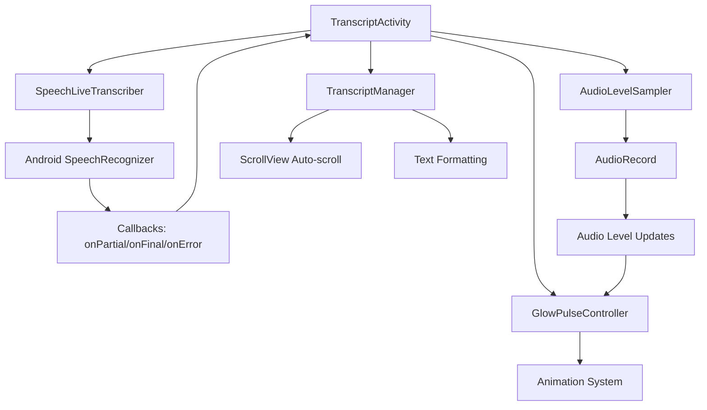

# Design Document

## Overview

The live transcription enhancement builds upon the existing TranscriptActivity architecture to provide seamless real-time speech-to-text functionality. The design leverages the current `SpeechLiveTranscriber`, `AudioLevelSampler`, and `GlowPulseController` utilities while enhancing the user experience with improved error handling, auto-scrolling, and better visual feedback.

The system follows a callback-based architecture where the `SpeechLiveTranscriber` provides real-time transcription updates through the `Callbacks` interface, while the UI layer handles display updates and user interactions.

## Architecture

### Component Interaction Flow



### State Management

The activity maintains several key states:
- **Recording State**: `isRecording`, `isPaused` - Controls overall recording session
- **Transcription State**: Managed by `SpeechLiveTranscriber` with automatic restart capability
- **UI State**: Visual indicators, button states, status text
- **Transcript State**: Partial text (temporary) and full transcript (persistent)

## Components and Interfaces

### Enhanced TranscriptActivity

**Responsibilities:**
- Coordinate recording and transcription lifecycle
- Handle UI state updates and user interactions
- Manage transcript display and auto-scrolling
- Provide error handling and user feedback

**Key Methods:**
- `startRecording()` - Initiates both audio recording and transcription
- `pauseRecording()` - Pauses both systems while preserving state
- `resumeRecording()` - Resumes from paused state
- `stopRecording()` - Stops all recording and resets state
- `updateTranscriptDisplay()` - Handles real-time text updates with auto-scroll

### TranscriptManager (New Component)

**Purpose:** Manages transcript text formatting, display updates, and auto-scrolling behavior.

**Interface:**
```java
public class TranscriptManager {
    public interface ScrollCallback {
        void onScrollToBottom();
    }
    
    public void updatePartialText(String partialText);
    public void appendFinalText(String finalText);
    public void clearTranscript();
    public String getFullTranscript();
    public void setScrollCallback(ScrollCallback callback);
}
```

**Responsibilities:**
- Format and combine partial and final transcript text
- Manage auto-scrolling to show latest content
- Handle text selection and copy functionality
- Maintain transcript history and formatting

### Enhanced SpeechLiveTranscriber

**Current Implementation:** Already provides robust continuous speech recognition with automatic restart on errors.

**Enhancements Needed:**
- Improved error categorization (network vs. temporary vs. critical)
- Better handling of silence periods
- Enhanced continuous mode stability

### UI Enhancement Components

**Auto-Scroll Handler:**
- Monitors transcript TextView content changes
- Smoothly scrolls to bottom when new content is added
- Respects user manual scrolling (pause auto-scroll when user scrolls up)

**Visual Feedback Controller:**
- Coordinates microphone animations with transcription state
- Provides visual indicators for different transcription states
- Handles smooth transitions between states

## Data Models

### TranscriptSession

```java
public class TranscriptSession {
    private String sessionId;
    private long startTime;
    private long duration;
    private StringBuilder fullTranscript;
    private String currentPartialText;
    private boolean isActive;
    private List<TranscriptSegment> segments;
}
```

### TranscriptSegment

```java
public class TranscriptSegment {
    private String text;
    private long timestamp;
    private boolean isFinal;
    private float confidence;
}
```

### RecordingState

```java
public enum RecordingState {
    IDLE("Ready to record"),
    LISTENING("Listening…"),
    PAUSED("Paused"),
    PROCESSING("Processing…"),
    ERROR("Error occurred");
    
    private final String displayText;
}
```

## Error Handling

### Error Categories

1. **Temporary Errors** (Auto-retry)
   - `ERROR_NO_MATCH` - No speech detected
   - `ERROR_SPEECH_TIMEOUT` - Silence timeout
   - Network timeouts

2. **Recoverable Errors** (User notification + retry)
   - `ERROR_NETWORK` - Network connectivity issues
   - `ERROR_SERVER` - Server-side problems
   - `ERROR_RECOGNIZER_BUSY` - Service temporarily unavailable

3. **Critical Errors** (Stop transcription, continue recording)
   - `ERROR_INSUFFICIENT_PERMISSIONS` - Missing microphone permission
   - `ERROR_AUDIO` - Hardware audio issues
   - Service unavailable

### Error Handling Strategy

```java
public class TranscriptionErrorHandler {
    public void handleError(int errorCode, String message) {
        switch (getErrorCategory(errorCode)) {
            case TEMPORARY:
                // Silent retry, no user notification
                scheduleRetry(500);
                break;
            case RECOVERABLE:
                // Show brief toast, attempt retry
                showUserNotification(message);
                scheduleRetry(2000);
                break;
            case CRITICAL:
                // Stop transcription, show error, continue audio recording
                stopTranscription();
                showPersistentError(message);
                break;
        }
    }
}
```

## Testing Strategy

### Unit Tests

1. **TranscriptManager Tests**
   - Text formatting and combination logic
   - Auto-scroll trigger conditions
   - Transcript history management

2. **Error Handler Tests**
   - Error categorization accuracy
   - Retry logic and timing
   - State transitions during errors

3. **State Management Tests**
   - Recording state transitions
   - UI state consistency
   - Lifecycle event handling

### Integration Tests

1. **Speech Recognition Integration**
   - Callback handling accuracy
   - Continuous mode stability
   - Error recovery scenarios

2. **UI Integration**
   - Real-time text updates
   - Auto-scroll behavior
   - Animation synchronization

### User Experience Tests

1. **Real-time Performance**
   - Transcription latency measurements
   - UI responsiveness during heavy transcription
   - Memory usage during long sessions

2. **Error Scenarios**
   - Network disconnection handling
   - Microphone permission revocation
   - Background/foreground transitions

## Implementation Phases

### Phase 1: Core Enhancement
- Implement `TranscriptManager` for better text handling
- Enhance auto-scrolling with user scroll detection
- Improve error categorization and handling

### Phase 2: UI Polish
- Smooth text update animations
- Enhanced visual feedback for transcription states
- Better loading and processing indicators

### Phase 3: Robustness
- Advanced error recovery mechanisms
- Performance optimization for long sessions
- Background processing improvements

## Performance Considerations

### Memory Management
- Limit transcript history to prevent memory leaks
- Efficient string building for large transcripts
- Proper cleanup of animation resources

### Battery Optimization
- Minimize wake locks during transcription
- Efficient audio sampling coordination
- Smart retry intervals to reduce CPU usage

### Network Efficiency
- Prefer offline speech recognition when available
- Implement smart fallback to online services
- Cache recognition models when possible